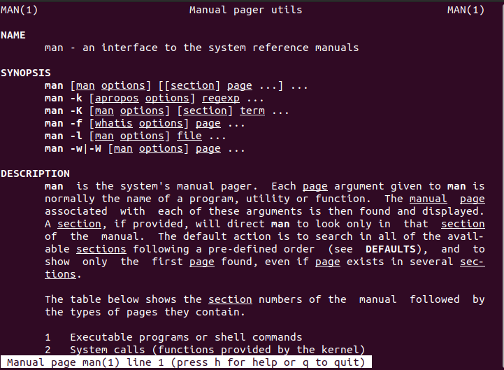
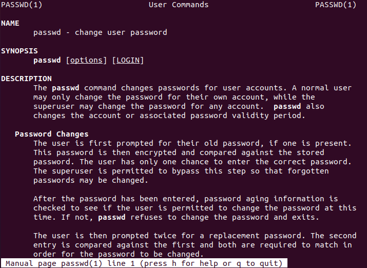

## Lệnh man dùng để làm gì

- Lệnh man để giúp người dùng Linux dễ dàng tìm hiểu cách thức sử dụng của một lệnh nào đó

## Cách dùng

Gõ lệnh sau để xem hướng dẫn chi tiết cách sử dụng lệnh man

---
-  man man
---

Một manpage có thể được chia thành 8 phần (section) được đánh số và mô tả như sau:

+ 1: Các lệnh dành cho người dùng thông thường.

+ 2: Các lời gọi hệ thống (System call).

+ 3: Các hàm thư viện C.

+ 4: Các file thiết bị nằm trong thư mục /dev, hay thông tin về driver

+ 5: Cấu trúc của 1 file nào đó.

+ 6: Games và screensavers

+ 7: Những thứ linh tinh khác…

+ 8: Các dịch vụ trên hệ thống và các công cụ dành cho việc quản trị Linux.

Lệnh man cho phép bạn tra cứu cách sử dụng của bất kỳ câu lệnh nào mà bạn muốn. Có thể ví lệnh man giống như một cuốn từ điển về dòng lệnh Linux vậy.

Cú pháp của lệnh man như sau:

---
- man tên lệnh cần tra cứu
---

VD: Nếu muốn xem hướng dẫn sử dụng lệnh passwd dùng thì gõ:

---
- man passwd
---

Thì man sẽ trả về tất cả hướng dẫn để thao tác với lệnh passwd

Kết quả trả về sau khi tìm kiếm trợ giúp sẽ được định dạng và hiển thị trong cửa sổ Terminal với các mục như:

NAME: Tên của lệnh, file, hàm, deamon,… và 1 dòng ngắn cho biết chức năng của nó

SYNOPSIS:  Đối với lệnh: cho biết cú pháp lệnh thường dùng.

Đối với hàm: liệt kê các tham số, file header cần dùng.

DESCRIPTION: Mô tả các chức năng mà hàm, lệnh cung cấp

OPTIONS: Chi tiết cách dùng lệnh passwd

 FILES: Các File Chứa Passwd

