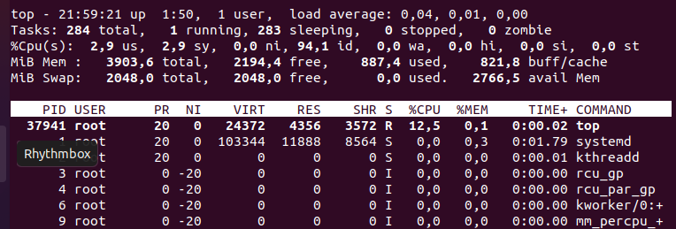

Lệnh TOP là một trong những lệnh cực kì quan trong cho admin quản trị hệ thống linux. Quản trị được các thông số, CPU, RAM, I/O , các tiến trình đang hoạt động trên hệ thống.

Lệnh trên giúp cho admin có thể giám sát hệ thống của mình một cách chuyên nghiệp và nắm rõ từng thông tin của hệ thống. Lệnh TOP tương tự Task manager trên windows. 

## Cách Chạy Lệnh Top

Về cơ bản, tất cả những gì bạn cần làm để hiển thị các tiến trình đang chạy hiện tại là gõ như sau vào terminal:

---
- top
---

## Thông Tin Được Hiển Thị

---
|Tên|Mô Tả|
|-|-|
|top|thời gian|
|up|máy tính chạy được bao lâu rồi|
|1 user|số lượng người dùng là 1|
|load average|trung bình tải|

|Tên|Mô tả|
|-|-|
|Tasks|tổng số nhiệm vụ ở đây là 284|
|1 running|số lượng tác vụ đang chạy là 1|
|sleeping|số lượng tác vụ trong trạng thái ngủ ở đây là 283|
|stopped|số lượng tác vụ đã dừng ở đây là 0|
|zombie|số lượng tác vụ không tồn tại ở đây là 0|

|Tên |Mô Tả|
|-|-|
|%CPU(s)|% mức sử dụng CPU theo tỷ lệ phần trăm|
|us| mức sử dụng CPU bời người dùng ở đây là 2.9%|
|sy|mức sử dụng CPU bởi hệ thống ở đây là 2.9%|
|ni|Mức sử dụng CPU bởi các tiến trình có mức ưu tiên thấp ở đây là 0%|
|id|Mức sử dụng CPU bởi idle process (tiến trình cho biết bộ xử lý đang rảnh rỗi) ở đây là 94.1%|
|wa|Mức sử dụng CPU bởi io wait (thời gian CPU không hoạt động để chờ I/O disk hoàn thành) ở đây là 0%|
|hj|Mức sử dụng CPU bởi việc ngắt phần cứng ở đây là 0%|
|sj|Mức sử dụng CPU bởi việc ngắt phần mềm ở đây là 0%|
|st|Mức sử dụng CPU bởi steal time (thời gian CPU ảo “chờ” CPU thực, trong khi bộ ảo hóa đang phục vụ bộ xử lý ảo khác) ở đây là 0%|

---
|Tên|Mô Tả|
|-|-|
|MiB Mem|Bộ nhớ đệm|
|total|tổng bộ nhớ đệm ở đây là 3903.6|
|free|bộ nhớ trống ở đâu là 2194.4|
|used|bộ nhớ đã sử dụng ở đây là 887.4|
|buffer cache|bộ nhớ đệm buffer cache ở đây là 821.8|

---
|Tên|Mô tả|
|-|-|
|MiB Swap|Bộ nhớ vùng swap | 
|total|tổng swap có sẵn ở đây là 2048|
|free|swap còn trống|
|used|swap đã sử dụng|
|avail Mem|bộ nhớ khả dụng|

---
|Tên|Mô tả|
|-|-|
|PID|ID tiến trình|
|USER |người dùng|
|PR |mức độ ưu tiên|
|NI |Mức độ nice (gọi một tập lệnh shell với mức độ ưu tiên cụ thể)|
|VIRT|bộ nhớ ảo được sử dụng bởi tiến trình|
|RES|bộ nhớ “thường trú” mà một tiến trình sử dụng (tức là tiến trình luôn ở trong bộ nhớ và không thể chuyển ra thiết bị lưu trữ khác)|
|SHR|bộ nhớ có thể chia sẻ|
|%CPU|CPU được sử dụng bởi tiến trình theo tỷ lệ phần trăm|
|%MEM|bộ nhớ được sử dụng bởi tiến trình theo tỷ lệ phần trăm|
|TIME|thời gian tiến trình đã được chạy|
|COMMAND|lệnh|

## Các tham số chính cho lệnh top

---
- -h Hiển thị phiên bản hiện tại

---

---
- -c Tham số này chuyển đổi trạng thái cột lệnh từ hiển thị lệnh sang hiển thị tên chương trình và ngược lại
---

---
- -d Chỉ định thời gian trễ khi refresh màn hình
---

---
- -o Sắp xếp theo trường được đặt tên
---

---
- -p Chỉ hiển thị các tiến trình với ID được chỉ định

---

---
- -u Chỉ hiển thị những tiến trình của người dùng được chỉ định
---

---

-i Không hiển thị các idle task

---

