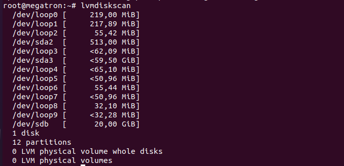
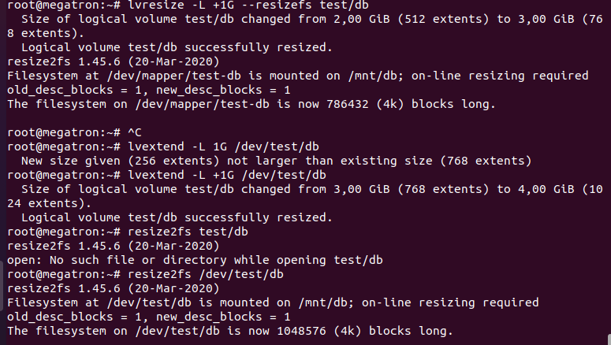

LVM là một phương pháp cho phép ấn định không gian đĩa cứng thành những Logical Volume khiến cho việc thay đổi kích thước trở lên dễ dàng ( so với partition ). Với kỹ thuật Logical Volume Manager (LVM) có thể thay đổi kích thước mà không cần phải
sửa lại partition table của OS. Điều này thực sự hữu ích với những trường hợp đã sử dụng hết phần bộ nhớ còn trống của partition và muốn mở rộng dung lượng của nó. Một số khái niệm cơ bản sử dụng trong LVM

- Physical Volume: Là một cách gọi khác của partition trong kỹ thuật LVM, là những thành phần cơ bản được sử dụng bởi LVM. Một Physical Volume không thể mở rộng ra ngoài phạm vi một ổ đĩa.

- Logical Volume Group: Nhiều Physical Volume trên những ổ đĩa khác nhau được kết hợp lại thành một Logical Volume Group, với LVM Logical Volume Group được xem như một ổ đĩa ảo. 

- Logical Volumes: Logical Volume Group được chia nhỏ thành nhiều Logical Volume, mỗi Logical Volume có ý nghĩa tương tự như partition. Nó được dùng cho các mount point và được format với những định dạng khác nhau như ext2,ext3 ext4 ... khi dung lượng của Logical Volume được sử dụng hết có thể đưa thêm ổ đĩa mới bổ sung cho Logical Volume Group và do đó tăng được dung lượng của Logical
Volume. 

### Thao Tác Với LVM

Đầu tiên chúng ta quét hệ thống để tìm các thiết bị khối mà LVM có thể nhìn thấy và quản lý. Chúng ta thực hiện lệnh sau:

---
- lvmdiskscan
---

Tạo physical volume

Ta sử dụng lệnh pvcreate theo cú pháp

---
- pvcreate /dev/(tên phân vùng)
---

ví dụ: Tạo physical volume trên phân vùng sdb

---
- pvcreate /dev/sdb
---

kiểm tra lại bằng lệnh pvs xem ta tạo được thành công physical volume hay chưa

---
- pvs
---

Tạo một Group volume

Ta sử dụng lệnh vgcreate theo cú pháp

- vgcreate (ten_group) /dev/(tên phân vùng 1) /dev/(tên phân vùng 2)

ví dụ: Tạo Group volume test trên phân vùng sdb

---
- vgcreate test  /dev/sdb
---

Để kiểm tra lại xem ta tạo được thành công Group volume hay chưa ta dùng câu lệnh

---
- vgs
---

Tạo một Logical volume

Ta sử dụng lệnh lvcreate theo cú pháp

- lvcreate -L size_volume -n (ten logical) (tên group volume)

ví dụ Tạo logical volume db trên group volume test

---
- lvcreate -L 2G -n db test
---

Chú Thích

|ký hiệu|mô tả|
|-|-|
|-L|kích thước cần tạo ở đây kích thước là 2G|
|-n|tên phân vùng cần tạo ở đây là "db"|

Để kiểm tra logical volume thì ta sử dụng lệnh lvs

---
- lvs
---

Sau khi tạo xong một logical volume muốn sử dụng được thì sẽ phải định dạng cho nó bằng mkfs

cú pháp 

- mkfs.định dạng  /dev/tên group volume/tên logical volume

ví dụ định dạng ext4 logicaldb trong group test

---
- mkfs.ext4 /dev/test/db
---

Sau khi định dạng xong ta phải tạo mount points để mount logical volume cú pháp là 

---
- mkdir /mnt/tên cần tạo để mount
---
ví dụ ở đây ta tạo một thư mục db trong thư mục mnt

---
- mkdir /mnt/db
---

Sau đó chúng ta mount vào vị trí thích hợp:

ví dụ là mount logical volume db trong group volume vào thư mục db trong thư mục mnt

---
- mount /dev/test/db /mnt/db
---

Sau đó ta vào /etc/fstab để thêm ổ đĩa mới tạo không sau khi khởi động lại chúng sẽ bị mất mount

---
- vi /etc/fstab
---

Trong đây ta có 2 cách để để thêm 
một là lấy mã UUID bằng câu lệnh "blkid" hai là chúng ta copy đường dẫn vừa mount ở trên 

Sau khi thao tác xong ta cần kiểm tra bằng lệnh xem có bị lỗi không để ta còn sửa. Nếu không báo gì là chúng ta đã thao tác thành công.

---
- mount -a
---

Lưu ý : Tuyệt đối không được reboot khi chạy lệnh "mount -a" báo lỗi để tránh hệ thống không khởi động lại được

## Tăng kích cỡ logical 

Để tăng kích cỡ logical volume db lên 1Gb mà không downtime, ta dùng lệnh sau:

---
- lvresize -L dung lượng cần tăng --resizefs group volume/tên logical cần tăng
---

Ví dụ tăng dung lượng logical db thêm 1G

---
- lvresize -L +1G --resizefs test/db

---

Còn một cách khác là dùng lệnh lvexten
sau đó phải dùng lệnh resize2fs để xác nhận thay đổi

---
- lvextend -L (n) /dev/(tên group)/(tên logical)
---

---
- resize2fs /dev/(tên group)/(tên logical)
---

|ký hiệu|mô tả|
|-|-|
|-L|cờ của lệnh|
|n|số lượng cần tăng|

## Giảm kích cỡ logical volume 

 Giảm kích cỡ logical volume 

---
 - lvreduce -L (n) /dev/(tên group)/(tên logical)
---

Thay đổi dung lượng của một group volume

Khi thay đổi dung lượng của một group volume thì ta sẽ thêm hoặc xóa phân vùng thuộc group để có thể thay đổi dung lượng của nó.

---
- vgextend tên group cần thêm /dev/ổ đĩa thêm vào group
---

ví dụ

---
- vgextend test /dev/sdc
---

Xóa một group volume ta thực hiện theo cú pháp

---
- vgremove /dev/tên group
---

Xóa một physical volume ta thưc hiện theo cú pháp

---
- pvremove /dev/tên phân vùng
---

