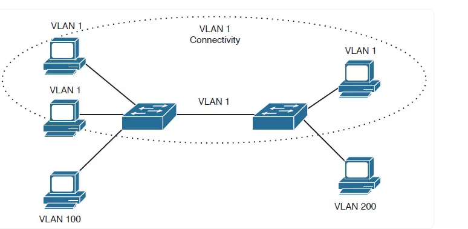

## VLAN là gì 

- VLAN (Virtual Local Area Network) là một mạng tùy chỉnh, được tạo từ một hay nhiều mạng cục bộ khác (LAN). Mạng VLAN cho phép một nhóm thiết bị khả dụng trong nhiều mạng được kết hợp với nhau thành một mạng logic. Từ đó tạo ra một mạng LAN ảo (Virtual LAN), được quản lý giống như một mạng LAN vật lý.

Nếu không có mạng Virtual LAN, một broadcast được gửi từ host có thể dễ dàng đi đến mọi thiết bị mạng. Khi đó, tất cả thiết bị đều sẽ xử lý những frame đã nhận broadcast đó. Việc này sẽ làm tăng đáng kể chi phí cho CPU trên mỗi thiết bị, đồng thời làm giảm khả năng bảo mật của hệ thống.

## Cách hoạt động của VLAN

- Các Virtual LAN ở trong mạng được xác định bằng một con số cụ thể
Phạm vi giá trị hợp lệ là 1- 4094. 

- Trên một switch VLAN, ta có thể chỉ định các cổng với số VLAN thích hợp.Tiếp đến, switch sẽ cho phép dữ liệu cần được gửi giữa các port khác nhau có cùng một Virtual LAN.

- Vì hầu hết các mạng đều có nhiều hơn là chỉ một switch duy nhất. Vì vậy, cần có một cách nào đó để có thể gửi lưu lượng giữa hai switch trong mạng. Cách đơn giản nhất chính là gán một port trên mỗi switch của Virtual LAN và chạy một cable giữa chúng.

## Ứng dụng của VLAN

- Đối với những mạng LAN có quy mô lớn, khoảng 200 thiết bị trở lên, thì việc sử dụng mạng Virtual LAN sẽ đem lại lợi ích to lớn

- Lý tưởng cho những mạng có lưu lượng truy cập cao

- Hữu ích cho những nhóm người dùng cần tính bảo mật cao, hoặc không thích mạng bị chậm do số lượng broadcast lớn

- Có thể được ứng dụng khi mạng có nhiều người dùng, nhưng lại không ở trên cùng một broadcast domain

- Có thể “biến hóa” một switch đơn nhất thành nhiều switch

