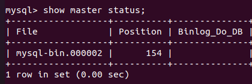
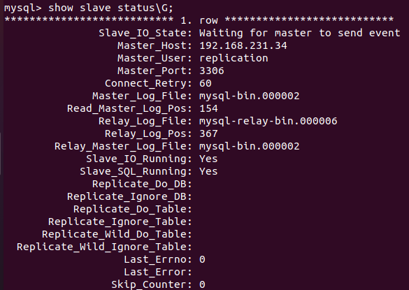
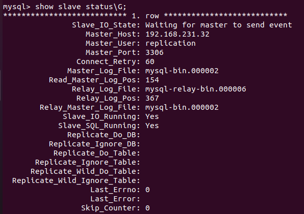
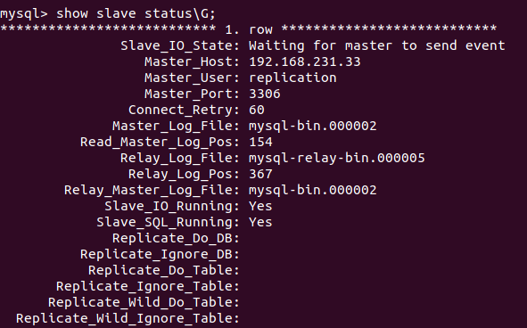
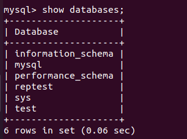
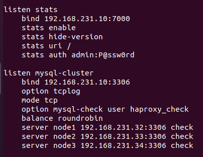
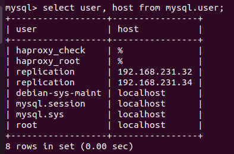
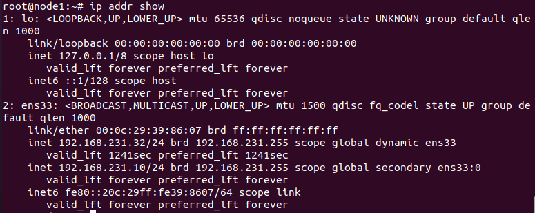
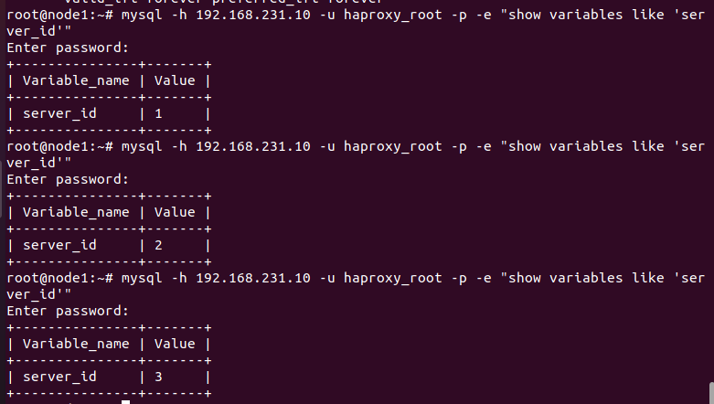

Triển khai muti node replication

ta cần 3 server để triển khai

cài đặt mysql trên cả 3 server.

---
- apt install mysql-server mysql-client -y

---

vào /etc/mysql/mysql.conf.d/mysqld.cnf

---
- vim /etc/mysql/mysql.conf.d/mysqld.cnf 
---

Thêm các dòng ở dưới và sửa server_id = 1 lần lượt từng server là 2 và 3

---

server_id           = 1

log_bin             = /var/log/mysql/
mysql-bin.log

log_bin_index       = /var/log/mysql/mysql-bin.log.index

relay_log           = /var/log/mysql/mysql-relay-bin

relay_log_index     = /var/log/mysql/mysql-relay-bin.index

expire_logs_days    = 10

max_binlog_size     = 100M

log_slave_updates   = 1

auto-increment-increment = 3

auto-increment-offset = 3

---

Khởi động lại mysql

---
- systemctl restart mysql.service 
---

chạy mysql secure

---

- mysql_secure_installation

---

Phần quyền đối với bản 18.4 thì dùng câu lệnh dưới làm lần lượt với từng server

---

- mysql> grant replication slave on *.* to 'replication'@'192.168.231.33' identified by '123.abc';

- mysql> grant replication slave on *.* to 'replication'@'192.168.231.34' identified by '123.abc';

---

Phần quyền đối với bản 20.4 thì dùng câu lệnh dưới làm lần lượt với từng server

---

mysql> create user 'replication'@'192.168.231.32' identified by '123.abc' ;

mysql> GRANT REPLICATION SLAVE ON *.* TO 'replication'@'192.168.231.42';

---

kiểm tra xem tài khoản replication có hoạt động trên tất cả các node không

---

- mysql -u replication -p -h 192.168.231.33 -P 3306

---

vào server node3 gõ

---
- mysql> show master status ;
---

sang server node1 gõ

---
mysql> change master to master_host='192.168.231.34' , master_port=3306,master_user='replication' , master_password='123.abc' , master_log_file='mysql-bin.000002' , master_log_pos=154 ;

mysql> change master to master_host='192.168.231.42' , master_port=3306,master_user='replication' , master_password='123.abc' , master_log_file='mysql-bin.000002' , master_log_pos=154 ;

---

sang server node2 gõ

---
mysql> change master to master_host='192.168.231.32' , master_port=3306,master_user='replication' , master_password='123.abc' , master_log_file='mysql-bin.000002' , master_log_pos=154 ;

mysql> change master to master_host='192.168.231.34' , master_port=3306,master_user='replication' , master_password='123.abc' , master_log_file='mysql-bin.000002' , master_log_pos=154 ;

---

sang server node3 gõ

---

mysql> change master to master_host='192.168.231.32' , master_port=3306,master_user='replication' , master_password='123.abc' , master_log_file='mysql-bin.000002' , master_log_pos=154 ;

mysql> change master to master_host='192.168.231.33' , master_port=3306,master_user='replication' , master_password='123.abc' , master_log_file='mysql-bin.000002' , master_log_pos=154 ;

---

cả 3 server node gõ

---

mysql> START SLAVE;

mysql> show slave status\G;

---

kết quả

server node1

server node2

server node3

kiểm tra replication.

tạo database

---

mysql> create database test ;

----

kết quả

Sử lý tự động khi node1 và node2 bị down với Haproxy + heartbeat

cài Haproxy trên câ 3 server

---

- apt install haproxy -y

---

vào /etc/haproxy/haproxy.cfg

---
- vim /etc/haproxy/haproxy.cfg

---

thêm trên câ 3 server

---
listen stats

    bind 192.168.231.10:7000
    
    stats enable

    stats hide-version

    stats uri /
    
    stats auth admin:P@ssw0rd

listen mysql-cluster

    bind 192.168.231.10:3306

    mode tcp

    option mysql-check user haproxy_check

    balance roundrobin

    server node1 192.168.231.32:3306 check
    server node2 192.168.231.33:3306 check
    server node3 192.168.231.34:3306 check

tạo user 

---

mysql> create user 'haproxy_check'@'%';

mysql> flush privileges;

mysql> create user 'haproxy_root'@'%' identified by '123.abc';

mysql> grant all privileges on *.* to 'haproxy_root'@'%' ;

---

kiểm tra user đã được replication .

---

mysql> select user, host from mysql.user;

---

kết quả

vào /etc/sysctl.conf 

---

- vim /etc/sysctl.conf

---

thêm trên cả 3 server

---

net.ipv4.ip_nonlocal_bind=1

---

kiểm tra

---

sysctl -p

---

nếu có lỗi thì vào /etc/haproxy chạy để kiểm tra lỗi

---

haproxy -f /etc/haproxy/haproxy.cfg -db

---

khởi động lại 

---

- systemctl restart haproxy

---

Cài đặt heartbeat

---
- apt install heartbeat -y

---

tạo authkeys trên cả 3 server

---

- vim /etc/ha.d/authkeys

---

thêm vào nội dung trên cả 3 server

---

auth 1

1 md5 123.abc

---

thay đổi quyền trên cả 3 server

---

- chmod 600 /etc/ha.d/authkeys

---

vào etc/ha.d/ha.cf tạo keepalive trên cả 3 server

---
- vim /etc/ha.d/ha.cf
---

thêm

---

keepalive 2

deadtime 10

udpport        694

bcast  ens33

mcast ens33 225.0.0.1 694 1 0

ucast ens33 192.168.231.33

ucast ens33 192.168.231.34

udp     ens33

logfacility     local0

node    node1

node    node2

node    node3

---

vim /etc/ha.d/ha.cf

keepalive 2
deadtime 10

udpport        694
bcast  ens33
mcast ens33 225.0.0.1 694 1 0
ucast ens33 192.168.231.32
ucast ens33 192.168.231.34
udp     ens33

logfacility     local0

node    node1
node    node2
node    node3

vim /etc/ha.d/ha.cf

keepalive 2
deadtime 10

udpport        694
bcast  ens33
mcast ens33 225.0.0.1 694 1 0
ucast ens33 192.168.231.32
ucast ens33 192.168.231.33
udp     ens33

logfacility     local0

node    node1
node    node2
node    node3

tạo haresources trên cả 3 server

---
- sudo nano /etc/ha.d/haresources
---

thêm node1 làm haresources trên cả 3 server

khởi động lại heartbeat và kiểm tra kết quả

---
- systemctl restart heartbeat.service
- systemctl status heartbeat.service
- ip addr show
---

kiểm tra loadbance

mysql -h 192.168.231.10 -u haproxy_root -p -e "show variables like 'server_id'"

khi chết node1 node2 

node3 được lên làm master

dựng lại cluster xong và dung file backup khôi phục lại database.

backup all database.

---
- mysqldump -av -u root  --all-databases > backup.sql
---
---
- mysql -v -u root  < backup.sql
---

mornitering và cảnh báo 

download check_mysql_health 

---

wget https://labs.consol.de/assets/downloads/nagios/check_mysql_health-2.2.2.tar.gz

---

giải nén và install 

---

tar xzf check_mysql_health-2.2.2.tar.gz

cd check_mysql_health-2.2.2

./configure

make

make install

---

---
- cp check_mysql_health /usr/lib/nagios/plugins
---

kết quả.

link tham khảo.

https://icinga.com/blog/2017/06/12/how-to-monitor-your-mysql-servers-with-icinga-2/

