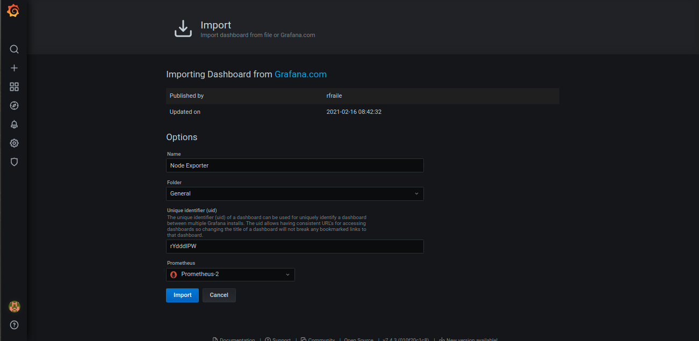
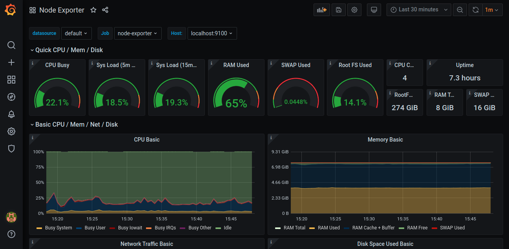

# 1 Cài đặt một số gói cần thiết 

```
yum install wget -y
```

# 2 Tạo một user cho service prometheus

```
useradd --no-create-home --shell /bin/false prometheus
```

# 3 Tạo và phân quyền thư mục 

```
mkdir /etc/prometheus
mkdir /var/lib/prometheus
chown prometheus:prometheus /etc/prometheus
chown prometheus:prometheus /var/lib/prometheus
```

# 4 Tải source code prometheus

```
cd /opt
wget https://github.com/prometheus/prometheus/releases/download/v2.27.1/prometheus-2.27.1.linux-amd64.tar.gz -O prometheus.tar.gz
tar xvf prometheus.tar.gz 
mv prometheus-2.27.1.linux-amd64 prometheus

cp prometheus/prometheus /usr/local/bin/
cp prometheus/promtool /usr/local/bin/

chown prometheus:prometheus /usr/local/bin/prometheus
chown prometheus:prometheus /usr/local/bin/promtool

cp -r prometheus/consoles /etc/prometheus
cp -r prometheus/console_libraries /etc/prometheus

chown -R prometheus:prometheus /etc/prometheus/consoles
chown -R prometheus:prometheus /etc/prometheus/console_libraries

```

# 5 Tạo một file cấu hình để tự scrape metric của chính prometheus server

```
cat <<EOF > /etc/prometheus/prometheus.yml
global:
  scrape_interval: 15s

scrape_configs:
  - job_name: 'prometheus'
    scrape_interval: 5s
    static_configs:
      - targets: ['localhost:9090']
EOF
```

# 6 Tạo file systemd

```
cat <<EOF > /etc/systemd/system/prometheus.service
[Unit]
Description=Prometheus
Wants=network-online.target
After=network-online.target

[Service]
User=prometheus
Group=prometheus
Type=simple
ExecStart=/usr/local/bin/prometheus \
    --config.file /etc/prometheus/prometheus.yml \
    --storage.tsdb.path /var/lib/prometheus/ \
    --web.console.templates=/etc/prometheus/consoles \
    --web.console.libraries=/etc/prometheus/console_libraries

[Install]
WantedBy=multi-user.target
EOF
```

# 7  Khởi động Prometheus sever

```
systemctl daemon-reload
systemctl start prometheus
systemctl status prometheus
systemctl enable prometheus
```
# 8 kiểm tra Prometheus sever

```
http://localhost:9090/graph

http://localhost:9090/metrics
```

# Cài đặt grafana

# 1 Tạo repo Grafana

```
vim /etc/yum.repos.d/grafana.repo

[grafana]
name=grafana
baseurl=https://packages.grafana.com/oss/rpm
repo_gpgcheck=1
enabled=1
gpgcheck=1
gpgkey=https://packages.grafana.com/gpg.key
sslverify=1
sslcacert=/etc/pki/tls/certs/ca-bundle.crt
```
# 2 Cài đặt Grafana

```
yum install grafana -y
```

# 3 Khởi động dịch vụ grafana

```
systemctl daemon-reload
systemctl start grafana-server
systemctl enable grafana-server
systemctl status grafana-server
```
# 4 Setup grafana

Sau khi đăng nhập vào grafana password mặc định là admin/admin Chọn Add data source để thêm Prometheus


Sau khi chọn data source thì chúng sẽ điền thông tin URL của grafana vào và chọn save & test


Khi data source hoạt động thì chúng ta chỉ cần cài đặt dashboard để hiển các thông số

Clich vào setting chọn Import


Sau khi chúng load dashboard lên thì chúng ta cần chọn data source cho dashboard đấy.



Và đây là kết quả




# Cài đặt prometheus trên node

# 1 Tạo user cho prometheus

```
useradd --no-create-home --shell /bin/false node_exporter
```
# 2 Tải source code

```
cd /opt
wget https://github.com/prometheus/node_exporter/releases/download/v0.18.1/node_exporter-0.18.1.linux-amd64.tar.gz

tar xvf node_exporter-0.18.1.linux-amd64.tar.gz

cp node_exporter-0.18.1.linux-amd64/node_exporter /usr/local/bin
chown node_exporter:node_exporter /usr/local/bin/node_exporter
```

# 3  Chạy exporter dưới systemd

```
cat <<EOF >  /etc/systemd/system/node_exporter.service
[Unit]
Description=Node Exporter
Wants=network-online.target
After=network-online.target

[Service]
User=node_exporter
Group=node_exporter
Type=simple
ExecStart=/usr/local/bin/node_exporter

[Install]
WantedBy=multi-user.target
EOF
```
# 4 Khởi động lại service

```
systemctl daemon-reload
systemctl start node_exporter
systemctl enable node_exporter
```
# 5 kiểm tra metric thu thập được trên node

```
http://192.168.115.134:9100/metrics

```
# 6 thêm node vào prometheus sever

```
vim /etc/prometheus/prometheus.yml

global:
  scrape_interval: 15s

scrape_configs:
  - job_name: 'prometheus'
    scrape_interval: 5s
    static_configs:
      - targets: ['localhost:9090']
  - job_name: 'node_1'
    scrape_interval: 5s
    static_configs:
      - targets: ['192.168.115.134:9100']
```

# 7 Khởi động lại service:

```
systemctl restart prometheus
```

Truy cập http://192.168.115.133:9090/graph để thực hiện query metrics

```
{instance="192.168.115.134:9100" , job=node_1"}
```

# Cấu hình cảnh báo trên server prometheus

# 1 Cài đặt Alert Manager

```
useradd --no-create-home --shell /bin/false alertmanager
cd /opt
wget https://github.com/prometheus/alertmanager/releases/download/v0.22.0-rc.1/alertmanager-0.22.0-rc.1.linux-amd64.tar.gz

tar xvf alertmanager-0.22.0-rc.1.linux-amd64.tar.gz

mv alertmanager-0.22.0-rc.1.linux-amd64/alertmanager /usr/local/bin/
mv alertmanager-0.22.0-rc.1.linux-amd64/amtool /usr/local/bin/

chown alertmanager:alertmanager /usr/local/bin/alertmanager
chown alertmanager:alertmanager /usr/local/bin/amtool
```

# 2 Sửa file /etc/alertmanager/alertmanager.yml (Nếu file chưa có thì có thể tạo và thêm

```
global:
  smtp_smarthost: 'smtp.domain.com:587'
  smtp_from: 'your_email@domain.com'
  smtp_auth_username: 'username'
  smtp_auth_password: 'password'


route:
  group_by: [alertname, datacenter, app]
  receiver: 'group-1'

receivers:
  - name: 'group-1'
    email_configs:
    - to: 'recipient-email@domain.com'
```

Cấp quyền cho file

```
chown alertmanager:alertmanager /etc/alertmanager/alertmanager.yml
```

- giải thích

```
global: chứa các biến global thông tin của email dùng để gửi mail cảnh báo như: tên email, username, password, máy chủ gửi mail 

(ví dụ máy chủ gửi thư của Gmail là smtp.gmail.com:587)

route: định nghĩa các group và nhóm người nhận muốn nhận cảnh báo

receivers: định nghĩa một nhóm người nhận group-1, liệt kê các địa chỉ email muốn nhận cảnh báo
```

# 3 Khởi chạy Alertmanager dưới systemd

```
[Unit]
Description=Alertmanager
Wants=network-online.target
After=network-online.target

[Service]
User=alertmanager
Group=alertmanager
Type=simple
WorkingDirectory=/etc/alertmanager/
ExecStart=/usr/local/bin/alertmanager --config.file=/etc/alertmanager/alertmanager.yml --web.external-url http://192.168.115.133:9093

[Install]
WantedBy=multi-user.target
```

Khởi động service

```
systemctl daemon-reload
systemctl enable alertmanager
systemctl status alertmanager
```

- Tạo rule alert trên Promethus server

```
touch /etc/prometheus/alert.rules.yml
```

- Phân quyền cho file mới tạo

```
chown prometheus:prometheus /etc/prometheus/alert.rules.yml
```
- thêm rules vào file mơi tạo để bắn cảnh báo

```
groups:
- name: Instances
  rules:
  - alert: InstanceDown
    expr: up == 0
    for: 10s
    labels:
      severity: page
    # Prometheus templates apply here in the annotation and label fields of the alert.
    annotations:
      description: '{{ $labels.instance }} of job {{ $labels.job }} has been down for more than 10 s.'
      summary: 'Instance {{ $labels.instance }} down'
```

- Check syntax cho file

```
/usr/local/bin/promtool check rules /etc/prometheus/alert.rules.yml
Checking /etc/prometheus/alert.rules.yml
  SUCCESS: 1 rules found
```

# 4 Khai báo service Alertmanager với Prometheus

```
vim /etc/prometheus/prometheus.yml
```
và thêm

```
rule_files:
  - alert.rules.yml

alerting:
  alertmanagers:
  - static_configs:
    - targets:
      - 192.168.115.133:9093
```

Khởi động lại Prometheus server:

```
systemctl restart prometheus
```

tắt node 1 kiểm tra và xem kết quả


